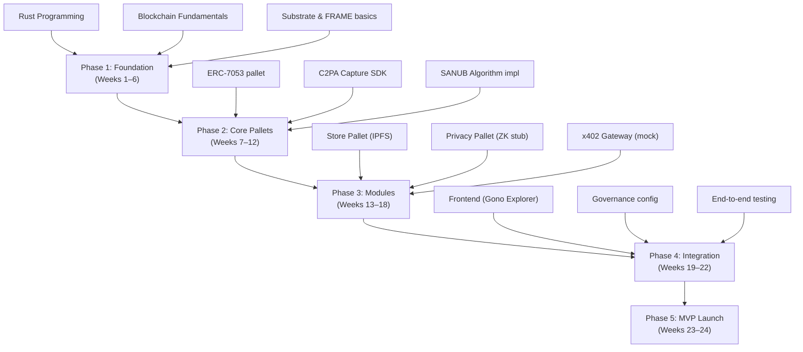

# Gono Protocol — Whitepaper Deep Analysis

> **Goal**: Identify everything needed to study/learn before building, what an agentic IDE can help with, fundamental limitations, and free alternatives for an MVP.

---

## 1. Prerequisites — What You Need to Study & Learn

### 🔴 Tier 1: Critical Foundation (Must-Know Before Starting)

#### 1.1 Rust Programming Language
- **Why**: Substrate (the blockchain framework) is written entirely in Rust. Every pallet, runtime, and node you build will be in Rust.
- **What to learn**: Ownership/borrowing, traits, generics, lifetimes, macros (`#[pallet::*]`), `no_std` programming, async Rust.
- **Free resources**: [The Rust Book](https://doc.rust-lang.org/book/), [Rust by Example](https://doc.rust-lang.org/rust-by-example/), [Rustlings exercises](https://github.com/rust-lang/rustlings).
- **Time estimate**: 4–8 weeks for proficiency.

#### 1.2 Substrate & FRAME Framework
- **Why**: The entire Gono Execution Rail (120) is a Substrate-based parachain. All pallets (Store 142, Verify 144, Privacy 146, x402 148) are FRAME pallets.
- **What to learn**:
  - Substrate node architecture (runtime vs. client)
  - FRAME pallet development (`#[pallet::config]`, `#[pallet::call]`, `#[pallet::storage]`, `#[pallet::event]`, `#[pallet::error]`)
  - Runtime composition and configuration
  - Extrinsics, storage, events, and errors
  - Weight system and benchmarking
  - Off-chain workers (for storage provider bridges)
- **Free resources**: [Substrate Developer Hub](https://docs.substrate.io/), [Polkadot SDK](https://github.com/nicktesla/polkadot-sdk), [Dot Code School](https://dotcodeschool.com/), [Open Polkadot Bootcamp 2025](https://openguild.wtf).
- **🤖 Agentic IDE can help**: Scaffolding pallet boilerplate, generating storage types, writing extrinsic handlers, implementing trait bounds.

#### 1.3 Blockchain Fundamentals
- **Why**: You need deep understanding of consensus, finality, state machines, and cryptographic primitives.
- **What to learn**:
  - Merkle trees, hash functions (SHA-256, Keccak-256), digital signatures
  - Consensus mechanisms (NPoS for Polkadot, BABE/GRANDPA)
  - State transitions and deterministic execution
  - Content-addressable storage (CIDs, IPFS hashing)
  - DAG structures (for version-controlled provenance chains)
- **Free resources**: [Polkadot Wiki](https://wiki.polkadot.network/), [MIT 6.5840 Distributed Systems](https://pdos.csail.mit.edu/6.824/).

#### 1.4 Polkadot Ecosystem Architecture
- **Why**: The whitepaper's Layer 1 (110) is the Polkadot Relay Chain. Understanding parachains, XCM, and shared security is mandatory.
- **What to learn**:
  - Relay Chain / Parachain model
  - Cross-Consensus Messaging (XCM) for cross-chain communication
  - Agile Coretime (replaces old parachain slot auctions)
  - Shared security model
  - Polkadot.js API for chain interaction
- **Free resources**: [Polkadot Wiki](https://wiki.polkadot.network/), Polkadot Academy lectures on YouTube.

---

### 🟡 Tier 2: Module-Specific Knowledge (Learn Per-Module)

#### 1.5 ERC-7053 Standard (Provenance Rail)
- **Why**: The core execution rail implements ERC-7053 for "Media Receipt" indexing. This is the backbone of the protocol.
- **What to learn**:
  - The ERC-7053 specification (content addressing, CIDs, Commit events)
  - How it integrates with C2PA metadata
  - Adapting an EVM standard to a Substrate pallet (not a smart contract — you're implementing the logic natively)
- **Free resources**: [EIP-7053 Spec](https://eips.ethereum.org/EIPS/eip-7053), [Numbers Protocol documentation](https://numbersprotocol.io/).
- **🤖 Agentic IDE can help**: Implementing the data structures, storage maps, and indexing logic as a FRAME pallet.

#### 1.6 C2PA (Coalition for Content Provenance and Authenticity)
- **Why**: The Capture stage (210) generates C2PA-compliant metadata. The Capture SDK is built on this standard.
- **What to learn**:
  - C2PA manifest structure (claims, assertions, signatures)
  - Signing and validation workflows
  - Integration with the `c2pa-rs` Rust library
- **Free resources**: [C2PA Specification](https://c2pa.org/specifications/), [c2pa-rs GitHub](https://github.com/contentauth/c2pa-rs) (open source), [CAI Open Source SDK](https://opensource.contentauthenticity.org/).
- **🤖 Agentic IDE can help**: Writing the SDK wrapper, metadata parsing, hash generation pipeline.

#### 1.7 Zero-Knowledge Proofs (zk-SNARKs)
- **Why**: The Privacy Pallet (146) uses zk-SNARKs for humanity proof, credential verification, and anonymous attestation.
- **What to learn**:
  - Arithmetic circuits and constraint systems (R1CS)
  - Groth16 proving system (recommended for MVP due to small proof size)
  - Circom circuit language + SnarkJS
  - Trusted setup ceremonies (Powers of Tau)
  - Verifier implementation in Substrate runtime
- **Free resources**: [Circom docs](https://docs.circom.io/), [SnarkJS GitHub](https://github.com/iden3/snarkjs), [ZK Learning](https://zk-learning.org/), [Rareskills ZK Book](https://www.rareskills.io/zk-book).
- **🤖 Agentic IDE can help**: Writing Circom circuit templates, generating SnarkJS verification scripts, implementing the Substrate verifier pallet.

> [!WARNING]
> ZK is the **steepest learning curve** in this entire protocol. Budget 6–12 weeks minimum. For MVP, consider starting with a simulated/stubbed privacy module and adding real ZK later.

#### 1.8 SANUB Reputation Algorithm
- **Why**: The Verify Pallet (144) implements SANUB for content credibility scoring.
- **What to learn**:
  - The mathematical formulas (equations 2–8 in the whitepaper): Public Belief (Bₙ), News Importance (Iₙ), Belief Sigmoid S(Bₙ), Analyst Credit (Cₐ), Reporter Credit (Cᵣ), Content Credibility (Cₙ)
  - Punishment weighting and its game-theoretic properties
  - Sybil resistance mechanisms
- **Free resources**: [Original SANUB Paper](https://ieeexplore.ieee.org/document/8876646) (Balouchestani et al., ISCISC 2019).
- **🤖 Agentic IDE can help**: Implementing all SANUB math formulas as Substrate pallet logic (fixed-point arithmetic on-chain), writing unit tests for edge cases.

#### 1.9 x402 Micropayment Protocol
- **Why**: The x402 Pallet (148) enables machine-to-machine payments via HTTP 402.
- **What to learn**:
  - x402 specification (HTTP 402 response format, payment proof submission)
  - Facilitator architecture
  - Integration with stablecoins (USDC) and native tokens (GONO)
  - Gateway implementation (off-chain component)
- **Free resources**: [x402.org specification](https://x402.org), [x402 GitHub](https://github.com/coinbase/x402), x402 Foundation docs.
- **🤖 Agentic IDE can help**: Building the x402 gateway service, HTTP handler logic, payment verification middleware.

#### 1.10 Decentralized Storage Integration
- **Why**: The Store Pallet (142) bridges to Arweave, Filecoin, and StorJ.
- **What to learn**:
  - Arweave's endowment model and bundlr/irys upload SDK
  - Filecoin deal-making and retrieval
  - StorJ API for erasure-coded storage
  - Off-chain worker patterns in Substrate for external API calls
- **🤖 Agentic IDE can help**: Writing the storage provider adapter interfaces, implementing off-chain workers.

---

### 🟢 Tier 3: Governance & Economics (Can Learn During Build)

#### 1.11 Token Economics (Tokenomics)
- **What to learn**: Gas fee models, staking mechanics, slashing conditions, endowment pools, conviction voting.
- **🤖 Agentic IDE can help**: Implementing `pallet-staking` configuration, fee calculation logic.

#### 1.12 Governance Framework
- **What to learn**: Polkadot OpenGov (3-tier governance), Conviction Voting, technical fellowships, on-chain referenda.
- **Free resources**: [Polkadot OpenGov docs](https://wiki.polkadot.network/docs/learn-polkadot-opengov).
- **🤖 Agentic IDE can help**: Configuring existing governance pallets (`pallet-democracy`, `pallet-collective`, `pallet-referenda`).

#### 1.13 Kleros Integration
- **What to learn**: `IArbitrableV2` interface, dispute lifecycle, PNK staking, cross-chain bridge to Kleros (Ethereum/Arbitrum).
- **Free resources**: [Kleros docs](https://docs.kleros.io/).

---

## 2. What an Agentic IDE Can Build For You

| Component | IDE Can Build? | Notes |
|:---|:---:|:---|
| Substrate pallet boilerplate | ✅ Full | Scaffolding all pallets with proper FRAME macros |
| ERC-7053 indexing logic | ✅ Full | Storage maps, CID indexing, DAG version control |
| SANUB math implementation | ✅ Full | Fixed-point arithmetic, all 7 formulas, unit tests |
| C2PA metadata parsing | ✅ Full | Using `c2pa-rs` library, hash generation |
| x402 gateway (off-chain) | ✅ Full | HTTP server, payment verification, routing |
| Substrate runtime configuration | ✅ Full | Composing pallets, configuring weights |
| Unit tests for all pallets | ✅ Full | Mock runtime, test scenarios, edge cases |
| Frontend dApp (Gono Explorer) | ✅ Full | React/Next.js + Polkadot.js API |
| ZK circuit templates (Circom) | ⚠️ Partial | Simple circuits yes; complex custom circuits need manual design |
| Storage provider adapters | ⚠️ Partial | API integration code yes; but testing requires actual provider accounts |
| Governance pallet config | ✅ Full | Configuring existing Substrate governance pallets |
| XCM message formatting | ⚠️ Partial | Boilerplate yes; complex cross-chain logic needs manual design |
| Tokenomics simulation | ⚠️ Partial | Can build simulation scripts; economic modeling needs human judgment |
| Kleros bridge contract | ⚠️ Partial | Interface code yes; cross-chain bridge is architecturally complex |

---

## 3. Shortcomings & Limitations for Building

### 🔴 Critical Blockers

| # | Limitation | Impact | Mitigation for MVP |
|:--|:---|:---|:---|
| 1 | **Parachain deployment cost** | Polkadot mainnet requires purchasing Agile Coretime (~significant DOT cost) | Use **Rococo testnet** (free) or run a **solo Substrate chain** for MVP |
| 2 | **Arweave storage requires real AR tokens** | Even small uploads cost real money (~$5–8/GB) | Use **IPFS + local pinning** (free) or Arweave devnet for MVP |
| 3 | **Kleros arbitration requires PNK tokens** | Dispute resolution has real on-chain costs on Ethereum/Arbitrum | **Stub out** Kleros for MVP; implement simple on-chain voting instead |
| 4 | **zk-SNARK trusted setup ceremony** | Groth16 requires a multi-party computation ceremony for production security | Use pre-existing **Powers of Tau** ceremony files (Hermez, Zcash) for dev; or use PLONK (universal setup) |
| 5 | **Cross-chain bridges (XCM, Kleros)** | Building secure cross-chain communication is extremely complex | MVP should be **single-chain only**; stub cross-chain features |

### 🟡 Significant Challenges

| # | Challenge | Details |
|:--|:---|:---|
| 6 | **No reference implementation of SANUB exists** | The 2019 paper is theoretical; no open-source code. You must implement from scratch based on the math. |
| 7 | **ERC-7053 is an EVM standard** | Needs adaptation from Solidity/EVM to Substrate/FRAME — not a direct port |
| 8 | **x402 is nascent** | The standard is very new (2024); limited tooling and SDKs available |
| 9 | **BrightID/Humanity verification** | Requires integration with external identity providers that may have API limits or cost |
| 10 | **Substrate learning curve** | Even with Rust experience, FRAME's macro system and runtime model are highly specialized |
| 11 | **On-chain fixed-point math** | SANUB formulas use floating-point (sigmoid, exponential decay) — Substrate runtimes use integer/fixed-point only |
| 12 | **Gono Sovereign Governance complexity** | Three-tier governance with reputation-weighted voting is very complex to implement and test |

### 🟢 Minor Issues

| # | Issue | Notes |
|:--|:---|:---|
| 13 | Capture SDK needs device-level integration | For production, needs mobile SDKs; MVP can use browser-based capture |
| 14 | AI Oracle integration | For MVP, can be a simple HTTP endpoint; production needs decentralized oracle networks |
| 15 | Multi-provider storage rebalancing | Complex SLA monitoring; MVP can use single provider |

---

## 4. Cost Analysis & Free Alternatives

### Tools/Services in the Whitepaper That Cost Money

| Whitepaper Component | Service | Cost | Free Alternative for MVP |
|:---|:---|:---|:---|
| **Layer 1 Security** | Polkadot Mainnet (Agile Coretime) | Significant DOT required | **Rococo Testnet** (free, public testnet) or **local Substrate devnet** (`substrate-node-template`) |
| **Permanent Storage** | Arweave | ~$5–8/GB (one-time) | **IPFS** (free with local pinning via `kubo`/`ipfs-desktop`) or **Crust Network** (has free tier) |
| **Permanent Storage** | Filecoin | Market-based deals | **Lighthouse.storage** (offers free tier for Filecoin storage) or **Web3.storage** (free tier up to 5GB) |
| **Permanent Storage** | StorJ | ~$4/TB/month | **StorJ has a free tier** (25GB free per month) — can use directly |
| **Dispute Resolution** | Kleros (PNK tokens) | Arbitration fees in ETH/PNK | **On-chain majority voting** (custom pallet) — implement simple dispute mechanism |
| **Identity/Sybil** | BrightID | Free to use but requires social graph | **Gitcoin Passport** (free, aggregation-based) or **simple CAPTCHA + rate limiting** for MVP |
| **x402 Payments** | Stablecoin settlement (USDC) | Gas fees on-chain | **Simulated token** on testnet; use test USDC on Sepolia or mock settlement |
| **ZK Proofs** | zk-SNARK proving infrastructure | Compute-intensive | **Circom + SnarkJS** (fully free, open source); local proving is free |
| **Blockchain Framework** | Substrate / Polkadot SDK | Free (open source) | ✅ Already free |
| **C2PA SDK** | `c2pa-rs` library | Free (open source) | ✅ Already free |
| **Development IDE** | Any Rust IDE | Free | ✅ VS Code + rust-analyzer (free) |

### Recommended Free MVP Stack

```
┌─────────────────────────────────────────────────┐
│              MVP Technology Stack                │
├─────────────────────────────────────────────────┤
│ Layer 1:  Local Substrate devnet (solo chain)   │
│ Runtime:  FRAME pallets in Rust                 │
│ Storage:  IPFS (local kubo node, free)          │
│ Privacy:  Circom + SnarkJS (free, open source)  │
│ Identity: Gitcoin Passport or stub              │
│ Capture:  c2pa-rs (free, open source)           │
│ Disputes: Custom voting pallet (no Kleros)      │
│ Payments: Mock x402 gateway + test tokens       │
│ Frontend: React + Polkadot.js API               │
│ Testnet:  Rococo (free) for parachain testing   │
└─────────────────────────────────────────────────┘
```

---

## 5. Recommended Study Roadmap for MVP



### Phase Breakdown

| Phase | Duration | Focus | Agentic IDE Role |
|:---|:---|:---|:---|
| **Phase 1** | Weeks 1–6 | Learn Rust, blockchain fundamentals, Substrate basics | Help with Rust exercises, explain concepts |
| **Phase 2** | Weeks 7–12 | Build core ERC-7053 pallet, C2PA integration, SANUB math | Generate pallet boilerplate, implement formulas, write tests |
| **Phase 3** | Weeks 13–18 | Build Store (IPFS), Privacy (ZK stub), x402 (mock) pallets | Build off-chain workers, gateway services, circuit templates |
| **Phase 4** | Weeks 19–22 | Frontend dApp, governance configuration, integration testing | Build React frontend, configure governance pallets, E2E tests |
| **Phase 5** | Weeks 23–24 | Deploy to Rococo testnet, polish, document | Help with deployment scripts, documentation |

---

## 6. Key Papers & Specifications to Read

| # | Document | Why |
|:--|:---|:---|
| 1 | [EIP-7053 Specification](https://eips.ethereum.org/EIPS/eip-7053) | Core standard your protocol implements |
| 2 | [SANUB Paper (Balouchestani et al., 2019)](https://ieeexplore.ieee.org/document/8876646) | Mathematical foundation for the Verify Pallet |
| 3 | [C2PA Specification v2.2+](https://c2pa.org/specifications/) | Metadata standard for content provenance |
| 4 | [x402 Protocol Spec](https://x402.org) | HTTP-native micropayment standard |
| 5 | [Polkadot Lightpaper & Wiki](https://wiki.polkadot.network/) | Shared security, XCM, governance models |
| 6 | [Substrate FRAME docs](https://docs.substrate.io/) | Building the actual runtime |
| 7 | [Kleros Whitepaper](https://kleros.io/whitepaper.pdf) | Dispute resolution (post-MVP) |
| 8 | [Groth16 Paper](https://eprint.iacr.org/2016/260) | ZK-SNARK proving system theory |

---

## 7. Summary: Priority Matrix

| Priority | Topic | Can IDE Help? | Cost? |
|:---|:---|:---:|:---:|
| 🔴 **Critical** | Rust programming | ✅ | Free |
| 🔴 **Critical** | Substrate / FRAME | ✅ | Free |
| 🔴 **Critical** | Blockchain fundamentals | ❌ (conceptual) | Free |
| 🔴 **Critical** | Polkadot ecosystem | ❌ (conceptual) | Free |
| 🟡 **Important** | ERC-7053 adaptation | ✅ | Free |
| 🟡 **Important** | C2PA integration | ✅ | Free |
| 🟡 **Important** | SANUB algorithm | ✅ | Free |
| 🟡 **Important** | x402 protocol | ✅ | Free |
| 🟡 **Important** | Decentralized storage | ⚠️ Partial | Free (IPFS) |
| 🟠 **Moderate** | Zero-knowledge proofs | ⚠️ Partial | Free (Circom) |
| 🟠 **Moderate** | Token economics | ⚠️ Partial | Free |
| 🟢 **Defer** | Governance (3-tier) | ✅ Config | Free |
| 🟢 **Defer** | Kleros integration | ⚠️ Partial | Paid (defer) |
| 🟢 **Defer** | BrightID integration | ❌ | Free |
| 🟢 **Defer** | Cross-chain (XCM) | ⚠️ Partial | Free (testnet) |
